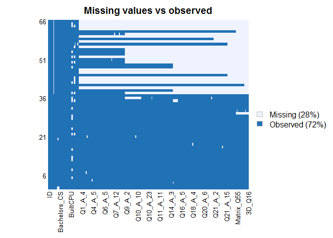

Tier 1 Cyber Assessment - Summary
================

## Missingness Map

<!-- -->

## Questionnaire Completion Totals

<table class="table table-striped table-hover table-condensed" style="margin-left: auto; margin-right: auto;">

<thead>

<tr>

<th style="text-align:left;position: sticky; top:0; background-color: #FFFFFF;">

Work\_Role

</th>

<th style="text-align:right;position: sticky; top:0; background-color: #FFFFFF;">

Partial

</th>

<th style="text-align:right;position: sticky; top:0; background-color: #FFFFFF;">

Complete

</th>

<th style="text-align:right;position: sticky; top:0; background-color: #FFFFFF;">

Total

</th>

</tr>

</thead>

<tbody>

<tr>

<td style="text-align:left;">

Tier\_1

</td>

<td style="text-align:right;">

10

</td>

<td style="text-align:right;">

9

</td>

<td style="text-align:right;">

19

</td>

</tr>

<tr>

<td style="text-align:left;">

Tier\_2

</td>

<td style="text-align:right;">

3

</td>

<td style="text-align:right;">

0

</td>

<td style="text-align:right;">

3

</td>

</tr>

<tr>

<td style="text-align:left;">

Tier\_3

</td>

<td style="text-align:right;">

8

</td>

<td style="text-align:right;">

11

</td>

<td style="text-align:right;">

19

</td>

</tr>

<tr>

<td style="text-align:left;">

Tier\_4

</td>

<td style="text-align:right;">

8

</td>

<td style="text-align:right;">

17

</td>

<td style="text-align:right;">

25

</td>

</tr>

</tbody>

</table>

## Completion Duration (minutes)

<!-- -->
